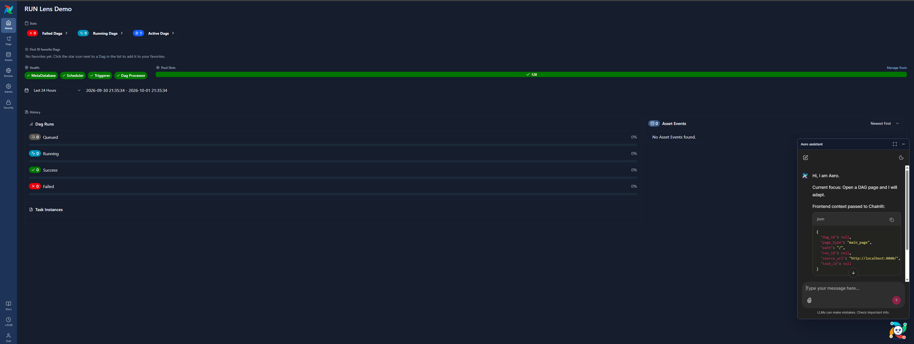
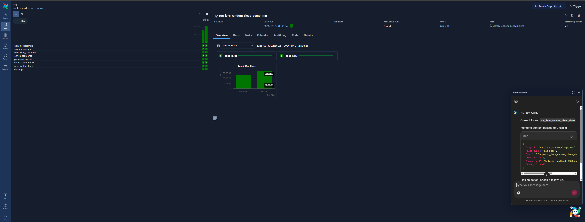

<div align="center">


# Aero for Apache Airflow

### Bring your own agent chat experience directly into the Airflow UI.

[](https://airflow.apache.org/)
[](https://www.python.org/)
[](https://fastapi.tiangolo.com/)
[](https://react.dev/)
[](https://www.typescriptlang.org/)
[](https://www.docker.com/)
[](LICENSE)

[Apache Airflow](https://airflow.apache.org/) · [Airflow Plugins](https://airflow.apache.org/docs/apache-airflow/stable/administration-and-deployment/plugins.html) · [Chainlit](https://github.com/Chainlit/chainlit) · [Strands](https://strandsagents.com/) · [FastAPI](https://fastapi.tiangolo.com/) · [React](https://react.dev/)

</div>

Aero is a local Apache Airflow 3 pattern for embedding an agent chat interface inside the Airflow experience without rebuilding the Airflow frontend from scratch. It uses an Airflow plugin, FastAPI, and Chainlit to mount a chat surface in Airflow, then lets you wire in your own LLM provider, agent framework, tools, and runtime logic behind it.

> Note: This repo includes a working DAG-aware assistant demo, but the main idea is broader: use Airflow as the operational surface, bring your own agent or agentic framework, and pass Airflow context into that agent so it can reason over the page, DAG, task, run, logs, or metadata the user is already looking at.

Right now, this project does three main things:

- runs a local Airflow 3 stack with PostgreSQL, Redis, and Celery workers
- mounts a custom Aero plugin into the Airflow UI so a chat application can read the current page context and DAG metadata
- exposes a Chainlit chat app that can call an agent runtime and answer questions about the current DAG/task context

This repository packages the full local development stack: Airflow, PostgreSQL, Redis, Celery workers, a custom Aero plugin, and a demo DAG for experimentation.

## Demo





## How it works

Aero is built around a simple integration pattern:

1. Airflow remains the primary frontend and operational workspace.
2. An Airflow plugin mounts a FastAPI application and a Chainlit chat UI under the Airflow web app.
3. Browser-side code captures the current Airflow page context and sends it to the backend.
4. The chat runtime reads that context and passes it to your agent, tools, or agentic framework.
5. The agent answers with access to real Airflow metadata, source files, and page context instead of relying only on generic model knowledge.

When an Airflow page loads, the frontend captures information such as the page type, DAG id, task id, run id, path, and source URL. The backend stores that context, and the Chainlit app reads it back when the user asks a question. The included demo agent then combines the current Airflow context with DAG metadata and source code.

At the moment, this is focused on DAG pages and related DAG/task context. The design is intentionally extensible: the same pattern can be used for task pages, run pages, logs, dataset events, deployment controls, or any future Airflow surface that exposes useful metadata. In other words, the idea is not only "AI for DAGs"; it is a reusable pattern for context-aware agent chat inside Airflow.

## Bring your own agent

Aero does not require you to adopt one specific agent architecture. Chainlit provides the chat interface, Airflow provides the host UI and operational context, and the backend boundary is where you can plug in the agent stack you already use.

You can adapt this pattern to:

- Strands, LangGraph, CrewAI, LlamaIndex, Semantic Kernel, custom Python agents, or any other agentic framework
- local models through Ollama, remote APIs, Bedrock, OpenAI-compatible endpoints, or provider-specific SDKs
- read-only assistants that explain DAGs, task runs, schedules, and logs
- action-oriented agents that open tickets, trigger remediation workflows, generate runbooks, or call internal platform APIs
- organization-specific tools that query lineage systems, data catalogs, observability platforms, incident systems, or deployment metadata

The important contract is simple: Airflow page context goes in, your agent/tool runtime decides what to do, and Chainlit streams the conversation back inside the Airflow experience.


### Chainlit

[Chainlit](https://github.com/Chainlit/chainlit) is a lightweight framework for building chat-based AI applications with Python. It provides the chat frontend so developers can focus on agent logic instead of recreating a conversational UI from scratch. Chainlit can also be mounted as a FastAPI application, and Airflow 3 supports FastAPI apps through its plugin architecture. In this project, that makes it possible to serve the browser-based Aero chat experience directly from the Airflow environment.


## Local Development With This Repo

Build and start the stack from the repo root:

```bash
cd airflow_docker
docker compose up --build -d
```

Check logs if needed:

```bash
docker compose logs -f airflow-scheduler
```

Shut the environment down when you are finished:

```bash
docker compose down
```

To reset the local database volumes as well:

```bash
docker compose down -v
```

After code changes to the React UI, rebuild the frontend bundle from the widget directory:

```bash
cd airflow_docker/widgets/aero-ui
pnpm install
pnpm run build
```

If the plugin changes do not appear, restart Airflow containers:

```bash
cd airflow_docker
docker compose restart airflow-apiserver
```

For more significant plugin or mount changes, recreate the stack:

```bash
docker compose down
docker compose up -d
```

## Demo DAG

This repo includes a demo DAG:

```text
airflow_docker/dags/run_lens_random_sleep_demo.py
```

It creates several `PythonOperator` tasks with randomized sleep durations. Trigger it multiple times to generate realistic DAG runs useful for testing runtime behavior, debugging delays, and exploring metadata-driven assistance.

## Access Points

Once the stack is running, use these endpoints:

- Airflow UI: http://localhost:8080
- Airflow login: username `airflow`, password `airflow`
- Aero app: http://localhost:8080/aero
- Aero Chainlit assistant: http://localhost:8080/aero/chainlit


## API and Integration Points

The Aero stack integrates with Airflow through:

- the custom plugin registration in `aero_plugin.py`
- context storage via `aero_context.py`
- the Chainlit app configured in `airflow_docker/aero/chainlit_app.py`
- FastAPI endpoints mounted under the Airflow plugin path

In practice, the assistant can inspect:

- current DAG metadata
- task dependencies and DAG structure
- task and run context from the current Airflow page
- DAG source files from the mounted `dags` directory

## Development Notes

- This is a local development environment, not a production deployment.
- The custom Aero layer is designed to be extended with more DAG analysis tools, richer LLM workflows, or a completely different agentic framework.
- The project uses Docker Compose for a reproducible local Airflow environment.
- FastAPI and Chainlit are mounted into the Airflow plugin runtime rather than running as separate services.

## Requirements

- Apache Airflow 3.x
- Docker with Compose support
- Python dependencies installed in the Airflow image
- Optional: Ollama or another compatible LLM endpoint for AI-assisted behavior
- Optional: Node.js and pnpm for frontend rebuilds

## License

Apache-2.0. See [LICENSE](LICENSE).
